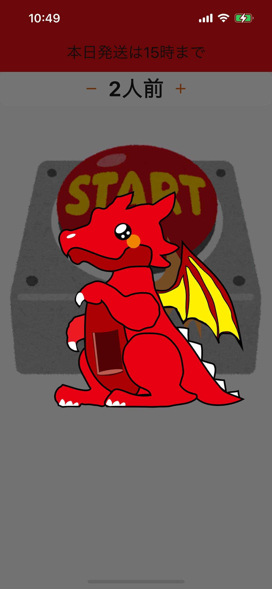

# Super Eats

ランダムメニューガチャで料理を決めて注文できるシンプルな Flutter アプリです。  
料理の種類や人数を選び、カートで合計金額を確認しながら注文を進めます。  
Lottie アニメーションで楽しく注文体験ができます。

## 使い方

1. アプリを起動すると、人数選択画面とガチャボタンが表示されます。
2. 人数を設定した後、ガチャボタンをタップするとランダムにメニューが選ばれます。
3. メニューが決まると注文確認ダイアログが表示され、「はい」でカート画面に進みます。
4. カート画面では、数量の変更や削除、合計金額の確認が可能です。
5. 「注文」ボタンを押すと最終確認ダイアログが表示され、注文を確定できます。

## 画像イメージ

| ホーム画面             | ガチャアニメーション     | カート画面             |
| ---------------------- | ------------------------ | ---------------------- |
|  |  |  |

## セットアップ

このアプリを動かすには、以下の環境が必要です。

- Flutter SDK 3.7.2 以上
- Dart SDK（Flutter に含まれています）

### インストール手順

```bash
# リポジトリをクローン
git clone https://github.com/dahutos2/super_eats.git
cd super_eats

# 依存パッケージをインストール
flutter pub get

# アプリを起動
make run
```

### ランチャーアイコンの生成（必要な場合）

```bash
make icon
```

## 補足

- アセットは `assets/json/`, `assets/images/`, `assets/icons/` に配置されています。
- 注文確認時やガチャの結果表示には Lottie アニメーションを利用しています。
